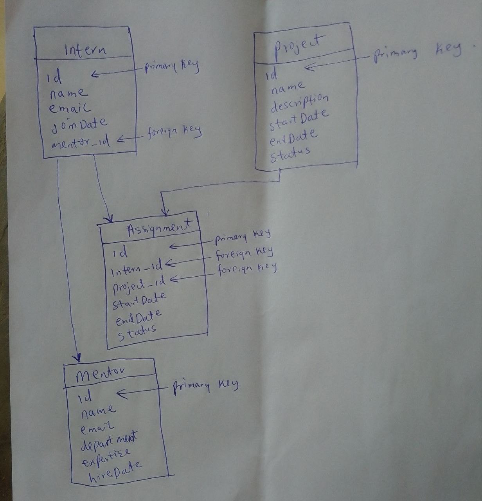

This project is all about design of database schema. Four Entrities where created inside a database name intern_managemnt_system.
The four entities are:- intern, project, assignment and mentor.
The intern entity has ManyToOne relationship with mentor (many interns can have one mentor). The intern entity also has OneToMany relationship with assignment entity (one intern can have many assignments).
The project entity has OneToMany relationship with assignment entity (one project can have many assignemnts).
